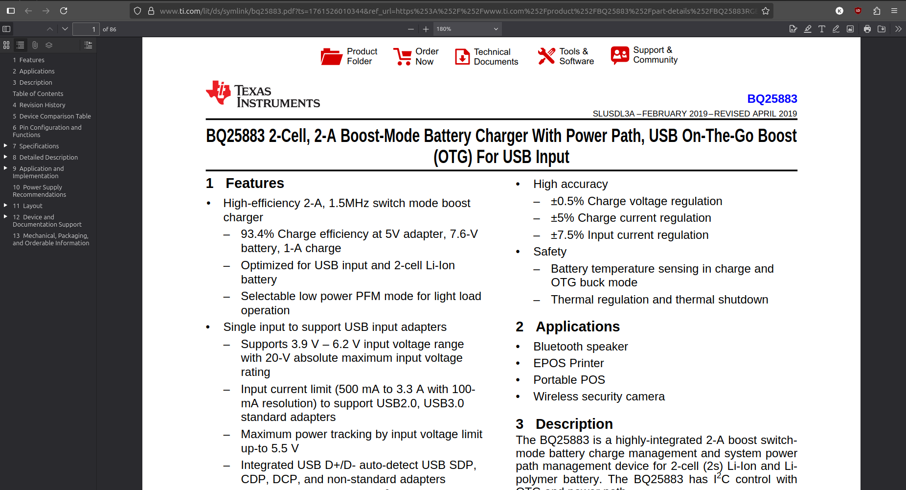
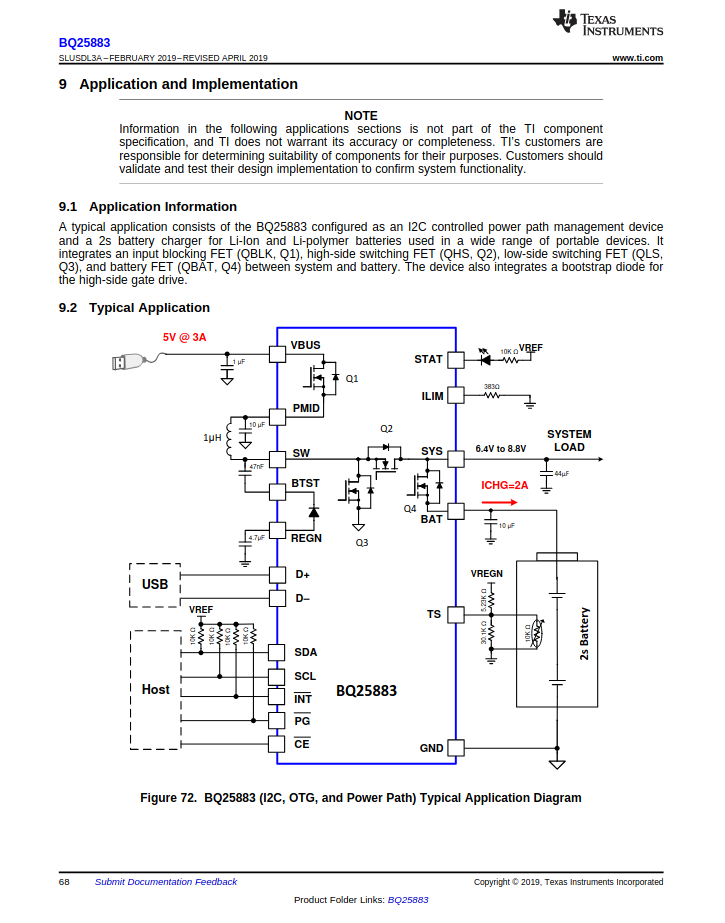

# How to make a flight controller (from scratch)

This is an advanced project. I recommend learning the basics of KiCad by making a small dev board or hackpad first. That said, anyone can follow along, as I'll go in-depth on how to build a flight controller.

First, define what type of flight controller you want. Is it for a rocket or a drone? Keep that in mind when starting your own design. In this guide, we'll build a flight controller specifically for rockets.

To start, create a new repository on GitHub and add two folders: `hardware` and `firmware`. These folders will hold most of the project files. Then create a new KiCad project inside the `hardware` folder.


(Folder structure)


(KiCad project files)

## Feature Definition

Before starting any engineering project, define the problem you're solving and the constraints you have. Imagine you want to build a rocket. All flight controllers include a `microcontroller`, which is a small computer that can be programmed to do various tasks. To control the rocket's flight, you'll use servos to actuate fins or a TVC system (`Thrust Vector Control`- tilting the engine nozzle to steer the rocket).

If you only build a board to drive servos, the rocket won't know which way it's pointing or how to correct its trajectory. You also need position and motion data (rotation and acceleration), plus altitude data. Finally, you'll want to store data persistently (even when powered off) for debugging and post‑flight analysis.

Now that we have the rocket's functionality defined, we also need a way to power it, so we can use a battery that can power both the rocket's computer and its servos.

Putting this together, we want these features in our rocket's flight controller:

- Can control servos for fins or TVC
- Can obtain position and altitude data
- Can store data even when powered off
- Can be powered by a battery

## Next steps

Now that we have our requirements, let's see how to meet them. Some requirements depend on others. For example, we want battery power - but how large should the battery be? That depends on the voltages and current the servos and microcontroller need, so let's define those first.

Depending on the size of your rocket, current needs will vary because larger servos draw more current. Most hobby servos run on 5–6V. A 2‑cell LiPo battery (7.4V nominal) is common in RC applications (each cell is ~3.7V) and can be regulated down to 5V for servos.

Most microcontrollers and sensors run on 3.3V, so with a 2‑cell (7.4V) LiPo we have more than enough input voltage - as long as we regulate it down to a clean 3.3V line.

Now, after ticking off one of the features, we need to tackle the three others.

- Can control servos for fins or TVC
- Can obtain position/altitude data
- Can store data even when powered off
- ~~Can be powered by a battery~~

After choosing servos, we need to know how to control them. Most hobby servos use `PWM (Pulse Width Modulation)` - a method of control where the microcontroller sends rapid on/off pulses, and the pulse width (duration) determines the servo's position.


The `duty cycle` is the percentage of the period that the signal is high (on).


## What about the sensors and microcontroller?

- ~~Needs to be able to control servos for fins or TVC~~
- Needs a way to get position/altitude data
- Needs to store data even when the rocket is off
- ~~Needs to be able to be powered by a battery~~

For position and motion data, we use an `IMU` - an Inertial Measurement Unit. The IMU measures acceleration and rotation (and some devices also estimate altitude). We'll use the `ICM-45686`. While there are many IMUs with different features, this one is robust and well‑supported.

For altitude, we'll use a dedicated sensor called a barometer. It measures air pressure and uses that to estimate altitude. We'll use the `BMP580` - a versatile and common choice for flight controllers.

Finally, to store data, we'll use a microSD card. While you can use onboard flash, microSD is more versatile when you want to access flight logs directly from a computer.

Now that we've defined the sensors and peripherals, we need to select a microcontroller. In this tutorial, we'll use an STM32, but you can adapt it to another MCU like the ESP32 if you want Bluetooth/Wi‑Fi support. I prefer STM32 because it's easy to program and widely used in flight controllers. After reviewing STM32 options, we'll use the STM32F722RET6 for its high clock speed and lots of peripherals. Feel free to choose another package or part for larger designs.

- ~~Needs to be able to control servos for fins or TVC~~
- ~~Needs a way to get position/altitude data~~
- ~~Needs to store data even when the rocket is off~~
- ~~Needs to be able to be powered by a battery~~

## Power Management

We have two power sources: USB‑C from your computer (5V) and a battery (about 7–8.4V for a 2‑cell LiPo). You cannot just wire them together. They need circuitry to choose which one feeds the board and to set the right voltages. The microcontroller typically runs at 3.3V, so we must reduce and clean up whatever comes in before it touches the MCU.

To change the voltages we need to use a regulator, and there are two kinds of regulators you'll hear about:

- `LDO` – Low Dropout regulator. It only turns higher voltage into a slightly lower one. Easy and quiet, but it wastes the extra as heat.
- `Switching regulator` – A more efficient regulator. It can:
  - `buck` (turn higher voltage down),
  - `boost` (push lower voltage up), or
  - `buck‑boost` (keep the output steady even if the input goes above or below it).

What we'll do on this board:

- Make a 3.3V line (for the MCU and sensors) using a buck regulator.
- Make a 5V line (for servos or accessories) using a buck‑boost regulator so it stays 5V even as the battery goes up and down.
- Get a battery charging IC (Integrated Circuit, e.g., chip) that can charge a 2 cell battery from 5V

Now that we've specified what functionality we need, we need to select the chips that have that. I personally love to use IC's from Texas Instruments as they have good documentation and also a huge selection of power management chips and everything and anything to do with USB.

Go to their website (https://www.ti.com/), select "Products", then "Battery Management ICs", and finally "Battery Charging ICs". Here you can find all sorts of battery charging chips to fit your requirements for future projects.


After looking around a bit, I found the `BQ25798`. It's a 2 Li-ion cell charger (which meets our requirement). You could add a more complicated battery charger if you want more cells/power, but they take up more space and are more complex to route.

For the regulators, go back to the TI main page, then navigate to "Power Management", then "DC/DC Power Modules". Here you can find all the regulators you would ever need, complete with excellent datasheets.


Here is where we can choose the right regulators for our needs. For this tutorial we are going to use the `TPS63070` which supports 2-16V input and can output a steady 5V with high current for the servos.

Now all that's missing is to find another regulator for 3.3V, for this we are going to us `LMR51430` as it is one tht supplies alot of amperage for the various sensors that w will be using.

Now that we have the chips that we are going to use, we also need to verify that they are available on some platform like [LCSC](https://lcsc.com) or wherever else you are going to manufacture your PCB. We also might have to import certain components through LCSC to KiCad.

## Final component list

- USB-C
- MicroSD
- TPS63070
- LMR51430
- BQ25798
- STM32F722RETx
- ICM-45686
- BMP580
- Optional LED

# Starting the schematic

Now that we have the components that we are going to use, let's start importing them into our project.

Although KiCad has a large selection of components, it still is a bit outdated and there are tons of chips that we would have to import in order to use them. Thankfully there is a library called [`easyeda2kicad.py`](https://github.com/uPesy/easyeda2kicad.py) that can import these components from LCSC for us.

I have made a simple helper script to import all of the LCSC ID's from a text file so all you have to do is append the part numbers and run the script again.

## Adding Custom Parts

Start by creating a folder called `lib` in the `/hardware` directory.

Then in the hardware directory, create a new file called `lcsc.txt` and leave it empty for now.

Then create a file called `lcsc.py` (or whatever name you want) and paste this code in there:

```import argparse
import os
import shutil
import subprocess
import sys

def run_easyeda2kicad_from_file(input_file, output_dir="./lib/lcsc", python_exec="python"):
    input_file = os.path.expanduser(input_file)
    output_dir = os.path.expanduser(output_dir)
    python_exec = python_exec or "python"

    if not os.path.isfile(input_file):
        print(f"Error: File not found: {input_file}")
        return 2

    # If a simple name was provided, check PATH; if an absolute path, check that file exists.
    found = shutil.which(python_exec) if os.path.basename(python_exec) == python_exec else os.path.exists(python_exec)
    if not found:
        print(f"Warning: Python executable '{python_exec}' not found in PATH or as given path. Trying anyway.")

    os.makedirs(output_dir, exist_ok=True)

    with open(input_file, "r", encoding="utf-8") as f:
        # ignore blank lines and comments
        lines = [line.strip() for line in f if line.strip() and not line.lstrip().startswith("#")]

    if not lines:
        print("No LCSC IDs found in input file.")
        return 0

    for idx, lcsc_id in enumerate(lines, start=1):
        cmd = [
            python_exec,
            "-m", "easyeda2kicad",
            "--full",
            f"--lcsc_id={lcsc_id}",
            f"--output={output_dir}",
        ]
        print(f"[{idx}/{len(lines)}] Running: {' '.join(cmd)}")
        try:
            subprocess.run(cmd, check=True)
        except subprocess.CalledProcessError as e:
            print(f"❌ Error processing {lcsc_id}: {e}")
        except FileNotFoundError as e:
            print(f"❌ Executable not found: {e}")
            return 3

    print("✅ All commands completed.")
    return 0

def main(argv=None):
    parser = argparse.ArgumentParser(description="Run easyeda2kicad for a list of LCSC IDs.")
    parser.add_argument("input_file", nargs="?", default="./hardware/lcsc.txt", help="Path to file with one LCSC ID per line")
    parser.add_argument("output_dir", nargs="?", default="./lib/lcsc", help="Output directory")
    parser.add_argument("--python", dest="python_exec", default="python",
                        help="Python executable to use (default: 'python')")
    args = parser.parse_args(argv)

    return_code = run_easyeda2kicad_from_file(args.input_file, args.output_dir, args.python_exec)
    sys.exit(return_code if isinstance(return_code, int) else 0)

if __name__ == "__main__":
    main()
```

This code basically calls the `easyeda2kicad.py` library for every line that is present in `lcsc.txt` and adds it to a kicad library in `/hardware/lib/lcsc`.

Now after creating both of those files, in your favorite IDE, edit `lcsc.txt` with the part numbers of the chips that you are going to use.

For example, let's say I want to add a USB-C port from LCSC. Go to [`www.lcsc.com`](www.lcsc.com) and search for usb-c.


After searching I found a good part with a large stock (important) so I then copy the part number (always starts with C followed by numbers, and it's under the name) into `lcsc.txt`.


It should look like this:


Then run the python script to convert that part number into a KiCad library. `IMPORTANT, YOU NEED TO RUN THE SCRIPT EVERY TIME YOU UPDATE lcsc.txt`. If you get an error that you can't find `lcsc.txt`, make sure to run the file from the root of your project or add arguments to specify the path of the library/lcsc txt file.

If you have done everything correctly you should have something that looks like this:


If in the future you get an error that the script couldn't find/parse a 3D model, those errors are safe to ignore as you can add the 3D model later, but if the script can't find/parse a footprint for a specific part then you should probably find another one through LCSC.

After running the script for the first time, add the library to your KiCad project and also the footprint library (the folder that ends with .pretty). It should look like this when you are done.


Then after that's done, go into your schematic and search for lcsc, you should find the library with the USB-C connector (or whatever other part you imported)


Keep in mind though that there are some parts that KiCad already has such as `BQ25798`, but there are others like the IMU that you will have to import.


After importing the component, my `lcsc.txt` looks like this:


Now going back to KiCad, add in all of the components (you may have to reopen the choose parts screen for the lcsc library to update).


## USB-C and Power

Now lets stwrt wiring up the power components and USB-C. It's alay goo practice to start wiring the componnts that ould b ue "first", in this case it woul b usB-c a it is going to recive voltage, then the batter connector as that voltage from usb-c is going to be directly charging the battery, an if there is no usb-c then the batter will provide voltage, then the 2 regulators. again, you can wire each componnt up in whatever order, I just do it like this to be a bit more orgnized.


This is the usb-C connector, as you can see it has a lot of pins but don't worry if you dont know what all of those mean as heres what each f those mean

- Shell: This is the outer case of the USB-C port, it's usually connected to ground
- GND: Ground lol
- VBUS: This is the pin that supplies voltage from th device that connects to it. Usually it provides 5V at 1.5A or 3A depening on the cable
- SBU1/2: These are low-speed lines that can be used as alternate pins for different accessories, such as AUx+ and au- when connected to a displayport, but we don't ned to use them
- CC1/2: the se are Configuration Channel pins, basiclly they detect if the connctor is flipped, and can also be ued to negotiate more power out of vbus (USB-PD). We aar going to conenct them to 5.1K resustors to ground a this tells the other device that we want 5V
- DN/DP: Thse re the USB lins that we will be conencting to the STM32, they area ued to trnsfer data between devices

Now ith tht informtion in mind, when you finish iring up the Usb-C connector it shoul look like this:


i used net labels to organize it better so that w dont have a spaghtti of cables all over the schematic.

### Battery charger (BQ25798)

Now let's ir up the batter charger as that is the net step in our powr route. There are many chips in the world an knowing th pins on each of them is virtually imposible, so each manufacturer has what's called a `datashet` for each component. It's basically a oumnt that details everything about that chip, its pinout, an evn how to implemnt it.

To access th datashet for any componnt in KicAd, simply click on th component and press D, but if thre isn't on, just seach on googl `[part] datashet` and its usually a pdf.

Opening the datasheet for the battery charger we are greeted with this:



this may look intimidating as thre ar 85 pges of letters, numers, formulas, and grphs, but there is one section tht is valuble to us called `Application and Implmntation`. this section basically gives us a refernce schmtic on ho to use said chip. We can us the sidebar or table of contents to locate that section, and you should see this:


