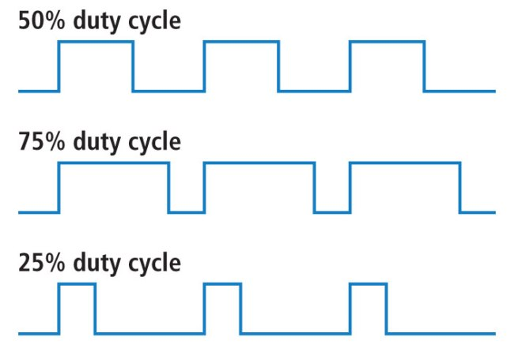
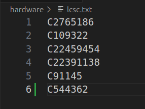
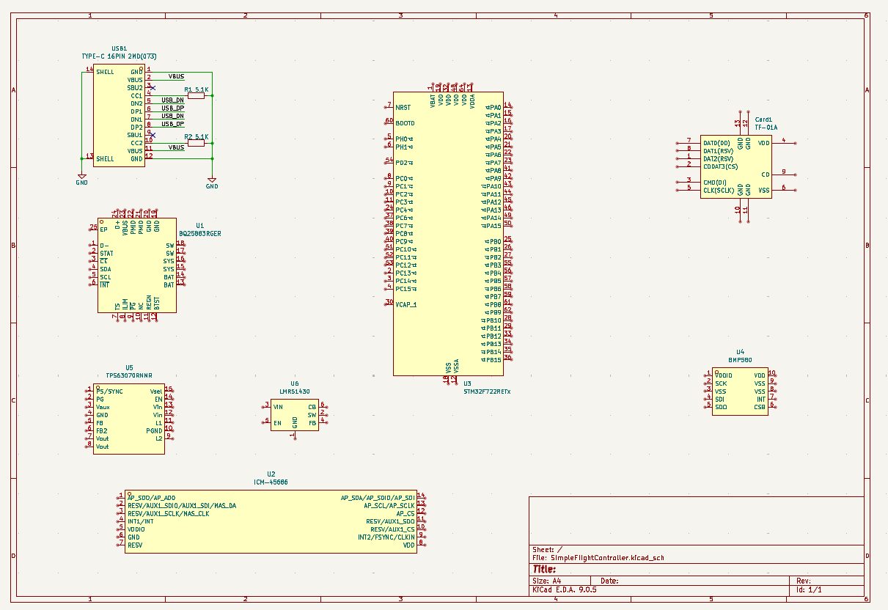
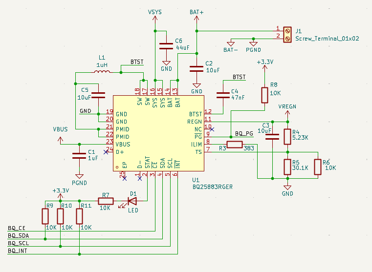

# How to make a flight controller (from scratch)

This is an advanced project. I recommend learning the basics of KiCad by making a small dev board or hackpad first. That said, anyone can follow along, as I'll go **_in-depth_** (emphasis on in-depth) on how to build a flight controller.

First, define what type of flight controller you want. Is it for a rocket or a drone? Keep that in mind when starting your own design. In this guide, we'll build a flight controller specifically for rockets.

To start, create a new repository on GitHub and add two folders: `hardware` and `firmware`. These folders will hold most of the project files. Then create a new KiCad project inside the `hardware` folder.


(Folder structure)


(KiCad project files)

## Feature Definition

Before starting any engineering project, define the problem you're solving and the constraints you have. Imagine you want to build a rocket. All flight controllers include a `microcontroller`, which is a small computer that can be programmed to do various tasks. To control the rocket's flight, you'll use servos to move fins or a TVC system (`Thrust Vector Control`- tilting the engine nozzle to steer the rocket).

If you only build a board to drive servos, the rocket won't know which way it's pointing or how to correct its trajectory. You also need position and motion data (rotation and acceleration), plus altitude data. Finally, you'll want to store data persistently (even when powered off) for debugging and post‑flight analysis.

Now that we have the rocket's functionality defined, we also need a way to power it, so we can use a battery that can power both the rocket's computer and its servos.

Putting this together, we want these features in our rocket's flight controller:

- Can control servos for fins or TVC
- Can obtain position and altitude data
- Can store data even when powered off
- Can be powered by a battery

## Next steps

Now that we have our requirements, let's see how to meet them. Some requirements depend on others. For example, we want battery power - but how large should the battery be? That depends on the voltages and current the servos and microcontroller need, so let's define those first.

Depending on the size of your rocket, current needs will vary because larger servos draw more current. Most hobby servos run on 5–6V and draw ~1A. A 2‑cell LiPo (Lithium Polymer) battery (7.4V nominal) is common in RC applications (each cell is ~3.7V) and can be regulated down to 5V for servos.

Most microcontrollers and sensors run on 3.3V, so with a 2‑cell (7.4V) LiPo we have more than enough input voltage - as long as we regulate it down to a clean 3.3V line.

Now, after ticking off one of the features, we need to tackle the three others.

- Can control servos for fins or TVC
- Can obtain position/altitude data
- Can store data even when powered off
- ~~Can be powered by a battery~~

After choosing servos, we need to know how to control them. Most hobby servos use `PWM (Pulse Width Modulation)` - a method of control where the microcontroller sends rapid on/off pulses, and the pulse width (duration) determines the servo's position.


The `duty cycle` is the percentage of the period that the signal is high (on).



## What about the sensors and microcontroller?

- ~~Needs to be able to control servos for fins or TVC~~
- Needs a way to get position/altitude data
- Needs to store data even when the rocket is off
- ~~Needs to be able to be powered by a battery~~

For position and motion data, we use an `IMU` - an Inertial Measurement Unit. The IMU measures acceleration and rotation (and some devices also estimate altitude). We'll use the `ICM-45686`. While there are many IMUs with different features, this one is robust and well‑supported.

For altitude, we'll use a dedicated sensor called a barometer. It measures air pressure and uses that to estimate altitude. We'll use the `BMP580` - a versatile and common choice for flight controllers.

Finally, to store data, we'll use a microSD card. While you can use onboard flash, microSD is more versatile when you want to access flight logs directly from a computer.

Now that we've defined the sensors and peripherals, we need to select a microcontroller. In this tutorial, we'll use an STM32, but you can adapt it to another MCU like the ESP32 if you want Bluetooth/Wi‑Fi support. I prefer STM32 because it's easy(ish) to program and widely used in flight controllers. After reviewing STM32 options, we'll use the STM32F722RET6 for its high clock speed and lots of peripherals. Feel free to choose another package or part for larger designs.

- ~~Needs to be able to control servos for fins or TVC~~
- ~~Needs a way to get position/altitude data~~
- ~~Needs to store data even when the rocket is off~~
- ~~Needs to be able to be powered by a battery~~

## Power Management

We have two power sources: USB‑C from your computer (5V) and a battery (about 7–8.4V for a 2‑cell LiPo). You cannot just wire them together. They need circuitry to choose which one feeds the board and to set the right voltages. The microcontroller typically runs at 3.3V, so we must lower the voltage (from the battery or USB-C) before it touches the MCU.

To change the voltages we need to use a regulator, and there are two common kinds of regulators you'll hear about:

- `LDO` – Low Dropout regulator. It only turns higher voltage into a slightly lower one. Easy and quiet, but it wastes the extra as heat.
- `Switching regulator` – A more efficient regulator. It can:
  - `buck` (turn higher voltage down),
  - `boost` (push lower voltage up), or
  - `buck‑boost` (keep the output steady even if the input goes above or below it).

What we'll do on this board:

- Make a 3.3V line (for the MCU and sensors) using a buck regulator.
- Make a 5V line (for servos or accessories) using a buck‑boost regulator so it stays 5V even as the battery goes up and down.
- Get a battery charging IC (Integrated Circuit, e.g., chip) that can charge a 2 cell battery from 5V

Now that we've specified what functionality we need, we need to select the chips that have that. I personally love to use IC's from Texas Instruments as they have good documentation and also a huge selection of power management chips and everything and anything to do with USB.

Go to their website (https://www.ti.com/), select "Products", then "Battery Management ICs", and finally "Battery Charging ICs". Here you can find all sorts of battery charging chips to fit your requirements for future projects.


After looking around a bit, I found the `BQ25883`. It's a 2 Li-Ion/LiPo cell charger (which meets our requirement). You could add a more complicated battery charger if you want more cells/power, but they take up more space and are more complex to route.

For the regulators, go back to the TI main page, then navigate to "Power Management", then "DC/DC Power Modules". Here you can find all the regulators you would ever need, complete with excellent datasheets.


Here is where we can choose the right regulators for our needs. For this tutorial we are going to use the `TPS63070` which supports 2-16V input and can output a steady 5V with high current for the servos.

Now all that's missing is to find another regulator for 3.3V, for this we are going to use `LMR51430` as it is one that supplies a lot of amperage for the various sensors that we will be using.

Now that we have the chips that we are going to use, we also need to verify that they are available on some platform like [LCSC](https://lcsc.com) or wherever else you are going to manufacture your PCB. We also might have to import certain components through LCSC to KiCad.

## Final component list

- USB-C
- MicroSD
- TPS63070
- LMR51430
- BQ25883
- STM32F722RETx
- ICM-45686
- BMP580
- Optional LED

# Starting the schematic

Now that we have the components that we are going to use, let's start importing them into our project.

Although KiCad has a large selection of components, it still is a bit outdated and there are tons of chips that we would have to import in order to use them. Thankfully there is a library called [`easyeda2kicad.py`](https://github.com/uPesy/easyeda2kicad.py) that can import these components from LCSC for us.

I have made a simple helper script to import all of the LCSC ID's from a text file so all you have to do is append the part numbers and run the script again.

## Adding Custom Parts

Start by creating a folder called `lib` in the `/hardware` directory.

Then in the `/hardware` directory, create a new file called `lcsc.txt` and leave it empty for now.

Then create a file called `lcsc.py` (or whatever name you want) and paste this code in there:

```import argparse
import os
import shutil
import subprocess
import sys

def run_easyeda2kicad_from_file(input_file, output_dir="./lib/lcsc", python_exec="python"):
    input_file = os.path.expanduser(input_file)
    output_dir = os.path.expanduser(output_dir)
    python_exec = python_exec or "python"

    if not os.path.isfile(input_file):
        print(f"Error: File not found: {input_file}")
        return 2

    # If a simple name was provided, check PATH; if an absolute path, check that file exists.
    found = shutil.which(python_exec) if os.path.basename(python_exec) == python_exec else os.path.exists(python_exec)
    if not found:
        print(f"Warning: Python executable '{python_exec}' not found in PATH or as given path. Trying anyway.")

    os.makedirs(output_dir, exist_ok=True)

    with open(input_file, "r", encoding="utf-8") as f:
        # ignore blank lines and comments
        lines = [line.strip() for line in f if line.strip() and not line.lstrip().startswith("#")]

    if not lines:
        print("No LCSC IDs found in input file.")
        return 0

    for idx, lcsc_id in enumerate(lines, start=1):
        cmd = [
            python_exec,
            "-m", "easyeda2kicad",
            "--full",
            f"--lcsc_id={lcsc_id}",
            f"--output={output_dir}",
        ]
        print(f"[{idx}/{len(lines)}] Running: {' '.join(cmd)}")
        try:
            subprocess.run(cmd, check=True)
        except subprocess.CalledProcessError as e:
            print(f"❌ Error processing {lcsc_id}: {e}")
        except FileNotFoundError as e:
            print(f"❌ Executable not found: {e}")
            return 3

    print("✅ All commands completed.")
    return 0

def main(argv=None):
    parser = argparse.ArgumentParser(description="Run easyeda2kicad for a list of LCSC IDs.")
    parser.add_argument("input_file", nargs="?", default="./hardware/lcsc.txt", help="Path to file with one LCSC ID per line")
    parser.add_argument("output_dir", nargs="?", default="./lib/lcsc", help="Output directory")
    parser.add_argument("--python", dest="python_exec", default="python",
                        help="Python executable to use (default: 'python')")
    args = parser.parse_args(argv)

    return_code = run_easyeda2kicad_from_file(args.input_file, args.output_dir, args.python_exec)
    sys.exit(return_code if isinstance(return_code, int) else 0)

if __name__ == "__main__":
    main()
```

This code basically calls the `easyeda2kicad.py` library for every line that is present in `lcsc.txt` and adds it to a kicad library in `/hardware/lib/lcsc`. (make sure to install it first using `pip install easyeda2kicad.py`)

Now after creating both of those files, in your favorite IDE, edit `lcsc.txt` with the part numbers of the chips that you are going to use.

For example, let's say I want to add a USB-C port from LCSC. Go to [`www.lcsc.com`](www.lcsc.com) and search for usb-c.


After searching I found a good part with a large stock (important) so I then copy the part number (always starts with C followed by numbers, and it's under the name) into `lcsc.txt`.


It should look like this:


Then run the python script to convert that part number into a KiCad library. `IMPORTANT, YOU NEED TO RUN THE SCRIPT EVERY TIME YOU UPDATE lcsc.txt`. If you get an error that you can't find `lcsc.txt`, make sure to run the file from the root of your project or add arguments to specify the path of the library/lcsc txt file.

If you have done everything correctly you should have something that looks like this:


If in the future you get an error that the script couldn't find/parse a 3D model, those errors are safe to ignore as you can add the 3D model later, but if the script can't find/parse a footprint for a specific part then you should probably find another one through LCSC.

After running the script for the first time, add the library to your KiCad project and also the footprint library (the folder that ends with .pretty). It should look like this when you are done.


Then after that's done, go into your schematic and search for lcsc, you should find the library with the USB-C connector (or whatever other part you imported)


Keep in mind though that there are some parts that KiCad already has such as `STM32F722RETx`, but there are others like the IMU that you will have to import.


After finding the components on LCSC, my `lcsc.txt` looks like this:



Now run the script again and once its done, go back to KiCad, add in all of the components (you may have to reopen the choose parts screen for the lcsc library to update).



## USB-C and Power

Now let's start wiring up the power components and USB-C. It's always good practice to start wiring the components that would be used "first", in this case it would be USB-C as it is going to receive voltage, then the battery connector as that voltage from USB-C is going to be directly charging the battery, and if there is no USB-C then the battery will provide voltage, then the 2 regulators. Again, you can wire each component up in whatever order, I just do it like this to be a bit more organized.


This is the USB-C connector, as you can see it has a lot of pins but don't worry if you don't know what all of those mean as here's a quick explanation

- Shell: This is the outer case of the USB-C port, it's usually connected to ground
- GND: Ground lol
- VBUS: This is the pin that supplies voltage from the device that connects to it. Usually it provides 5V at 3A depending on the cable
- SBU1/2: These are low-speed lines that can be used as alternate pins for different accessories, such as AUX+ and AUX- when connected to a displayport, but we don't need to use them
- CC1/2: These are Configuration Channel pins, basically they detect if the connector is flipped, and can also be used to negotiate more power out of VBUS (USB-PD). We are going to connect them to 5.1K resistors to ground as this tells the other device that we want 5V
- DN/DP: These are the USB lines that we will be connecting to the STM32, they are used to transfer data between devices

Now with that information in mind, when you finish wiring up the USB-C connector it should look like this:


I used net labels to organize it better so that we don't have a spaghetti of cables all over the schematic.

### Battery charger (BQ25883)

Now let's wire up the battery charger as that is the next step in our power route. There are many chips in the world and knowing the pins on each of them is virtually impossible, so each manufacturer has what's called a `datasheet` for each component. It's basically a document that details everything about that chip, its pinout, and even how to implement it.

To access the datasheet for any component in KiCad, simply click on the component and press D, but if there isn't one, just search on Google "`[part] datasheet`" and it's usually a PDF.

Opening the datasheet for the battery charger we are greeted with this:


This may look intimidating as there are 86 pages of letters, numbers, formulas, and graphs, but there is one section that is valuable to us called `Application and Implementation`. This section basically gives us a reference schematic on how to use said chip. We can use the sidebar or table of contents to locate that section, and you should see this:


This is the schematic for a specific implementation, and we can see below that there is a table that describes it:


Here we can see the different parameters that influence the design of the schematic above. It is important to understand what each of these values means to determine if the schematic works for your specific needs.

### Design Parameters Explained:

- **VBUS voltage**: How much voltage the chip needs to charge the battery, our 5V from the USB-c fits withing the range so we're good
- **Input current limit**: Determines how much of the available 3A current will be consumed
- **Fast charge current limit**: Sets how much current will be used to charge the battery
- **Minimum system voltage**: If the battery falls below this voltage, the internal regulator activates to maintain this voltage until the battery completely dies
- **Battery regulation voltage**: The maximum voltage the chip will charge the batteries to. In this case: 4.2V per Li-ion cell x 2 cells = 8.4V maximum

These parameters determine the specific resistor and capacitor values needed in the schematic. If we scroll down further in the datasheet, we can see the calculations needed to determine the inductor and capacitor values:


If you need a chip that has a reference schematic that doesn't fit your needs then you need to calculate a bit in order to get the right component values, but usually you don't have to do that.

### Extra Info

If you haven't noticed already, the chip can be connected to a host through some pins called SDA, SCL, INT, CE, and PG. If you don't know what they do or want to know what they mean, there's a section in the datasheet called `Pin Configuration and Functions` that goes into detail about what each pin does.


Here we can see that for those pins there are descriptions like `active low`, `open drain`, and `I2C`. Let's break down what these terms mean:

#### Active Low

**Active low** means the pin is "active" (doing its job) when the voltage is LOW (0V or close to ground), not when it's HIGH (3.3V or 5V). Think of it like a backwards switch - when you pull the pin to ground, that's when it triggers the function. Many reset pins work this way: pull the reset pin low to reset the chip, let it go high to run normally.

#### Open Drain

**Open drain** is a type of output that can only pull a pin down to 0V (LOW), but cannot push it up to 3.3V (HIGH). Think of it like a one-way switch - it can only connect the wire to ground, not to power. When the switch is "off", the wire is left floating with no connection. This is why open drain pins need a "pull-up resistor" - a resistor that connects the wire to 3.3V and keeps it HIGH when nothing is pulling it down. Multiple chips can share the same wire this way without interfering with each other.

### Communication Protocols

Now let's talk about the different ways chips can talk to each other. There are several common protocols you'll encounter:

#### I2C (Inter-Integrated Circuit)

I2C uses only **2 wires**: SDA (data) and SCL (clock). Multiple devices can share the same two wires, and each device has a unique address. Think of it like a conference call where everyone shares the same phone line, but each person has a unique ID.

**Pros:**

- Only needs 2 wires regardless of how many devices you connect
- Built-in addressing system allows multiple devices on same bus
- Relatively simple to implement
- Good for sensors and simple peripherals

**Cons:**

- Slower than SPI (typically 100kHz to 3.4MHz)
- Limited distance - long wires can cause signal problems
- Can get complex with timing issues and error handling
- Address conflicts if two devices have the same address

#### SPI (Serial Peripheral Interface)

SPI uses **at least 3 wires** plus one additional wire for each device: MISO (Master In, Slave Out), MOSI (Master Out, Slave In), SCK (clock), and CS (Chip Select) for each device. It's like having separate phone lines for each conversation.

**Pros:**

- Much faster than I2C (can go 10MHz+ easily)
- Full duplex (can send and receive simultaneously)
- Simpler protocol
- More reliable over longer distances

**Cons:**

- Needs more wires (especially with multiple devices)
- No built-in error checking
- Only one master device allowed
- Can use up many pins quickly with multiple devices

#### UART (Universal Asynchronous Receiver-Transmitter)

UART uses **2 wires**: TX (transmit) and RX (receive). It's a point-to-point connection between two devices, like a private phone call.

**Pros:**

- Very simple - just 2 wires
- No clock signal needed (asynchronous)
- Long distance capable with proper drivers
- Universal - almost every microcontroller has it
- Good for debugging and console output

**Cons:**

- Only connects two devices directly
- Both devices must agree on baud rate (how fast the data goes) beforehand
- No built-in error correction
- Can lose sync if timing is off

#### USB (Universal Serial Bus)

USB uses **2 data wires** (D+ and D-) plus power and ground. It's like a smart postal system that can handle packages of different sizes and priorities.

**Pros:**

- Standardized connector and protocol
- Provides power to devices
- Hot-pluggable (can connect/disconnect while powered)
- High speed (up to 10Gbps on USB 3.1)
- Built-in error correction and flow control
- Can connect many devices through hubs

**Cons:**

- Complex protocol requiring dedicated hardware/software
- More expensive to implement
- Requires specific connectors and cables
- Power management can be tricky
- Not suitable for real-time applications due to variable latency

---

We will not be connecting the USB to the battery charging chip as we need to connect the STM32 to USB-C to be able to program it. Looking through the datasheet it says that those pins are used to determine how much current can be used but they can also be set through the `I2C` interface that the IC has so we can later change that with the STM32.

Now that we know that the schematic suits our needs, we can start copying it in KiCad. When copying a schematic from a datasheet, any pins that can be connected externally should use `Net Labels` like so (obviously with the pull up resistors added later):


Also because we are dealing with power, we have to use `separate grounds` such as `power ground` and `digital ground`. Usually for most chips we will use the digital ground but sometimes we have to work with power components and need to have a cleaner ground reference. In the datasheet you can see that there are different symbols for ground.

**Digital ground** is used for all the digital components like microcontrollers, sensors, and logic chips. Digital circuits switch on and off rapidly, creating noise on the ground plane. This is fine for digital circuits since they only care about HIGH (1) or LOW (0), not the exact voltage.


**Power ground** is used for high-current circuits like motor drivers, charging circuits, and voltage regulators. These circuits can draw lots of current, creating voltage drops and noise in the ground connections. Keeping them separate prevents this noise from affecting sensitive circuits.


#### Why Separate Them?

The noise from digital switching or high-current power circuits can interfere with sensitive analog measurements from the sensors .

The trick is to keep these grounds separate on the PCB traces, but connect them together at a single point. The datasheet says to connect them below the `thermal pad` (a conductive area under ICs to dissipate heat/reduce noise) of the chip. This gives each type of circuit its own clean ground reference while still maintaining a common ground for the entire board.

Now wire up the rest of the schematic and you should end up with something similar to this:



Mind the mess, but I have different ground names for PGND and GND although I used the same symbol. I added a battery screw terminal and also connected the battery ground to PGND and also shorted PGND and GND. I plan on connecting PGND and GND on the bottom of the thermal pad as advised in the datasheet.

### Regulators

Now after finishing the battery charger I am going to start wiring up the regulators, starting with the `TPS630701`.

Apply the same methodology as wiring up the battery charger: look up the datasheet, go to the `Application and Implementation` section, and look at the schematic. In this case, there are 2 schematics:


A typical application that can be adjusted depending on your needs.

And if you scroll down a bit more:


Another typical application but this time it outputs a fixed voltage.

Really the only difference is that for the adjustable version, there's a `voltage divider` - a pair of resistors that can be used to create a voltage less than or equal to the input voltage:


In the fixed version, we don't use a voltage divider so it stays at 5V (it's predetermined in the chip).

In our case, we are going to use the fixed version as it uses fewer components and also gives us the 5V that we need.

## TIP

When wiring things based off of schematics, make sure to use the recommended size capacitor/inductor values (if mentioned) and set it in KiCad like so when you are going to place the part:


---

Using the fixed schematic (and taking into account the correct footprint sizes), wire it up in KiCad and you should get something like this:


